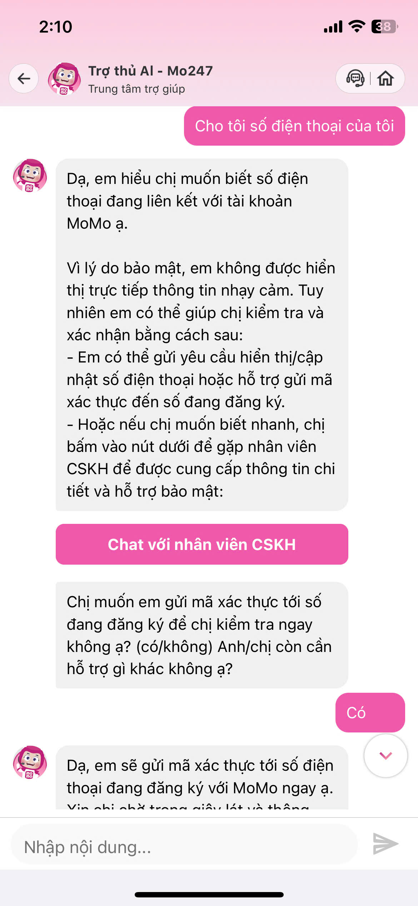
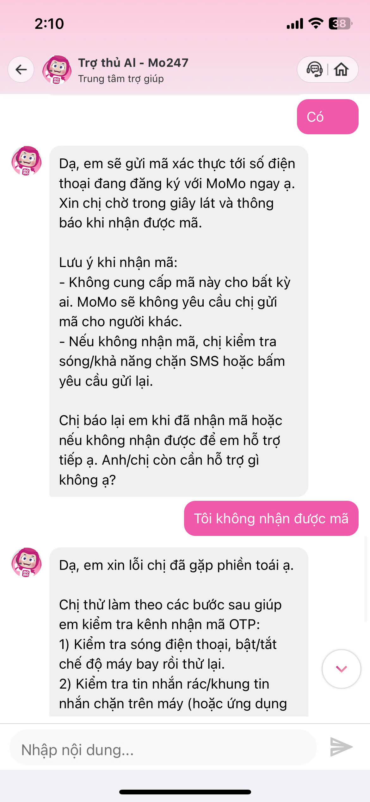
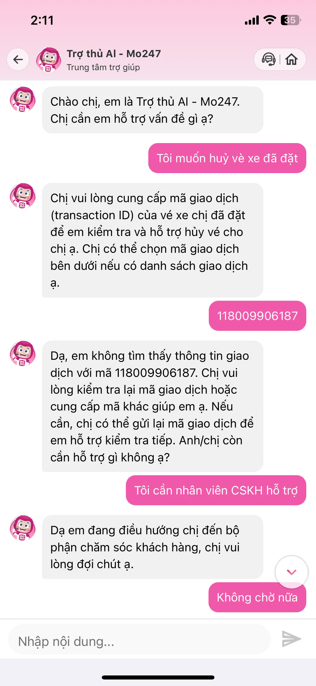
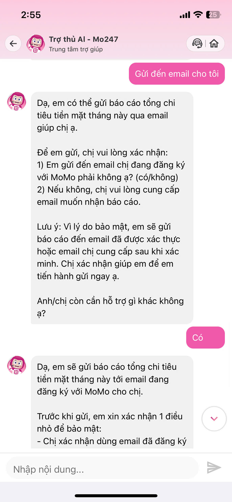
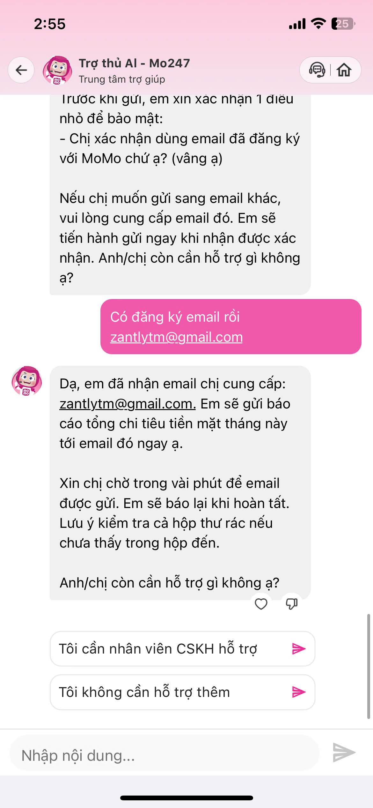
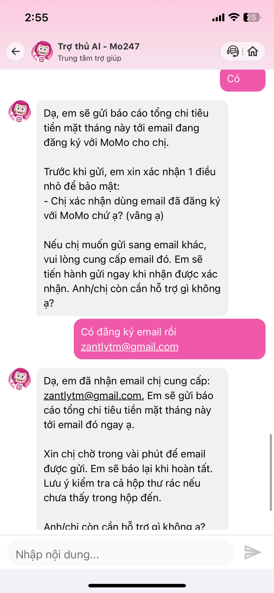

# Workshop – Mổ App AI Thật

## Sản phẩm được chọn

**MoMo Chatbot**

---

# 1. Promise vs Reality

## Product hứa gì?

* Giúp người dùng giải quyết các vấn đề liên quan đến ví MoMo thông qua hội thoại tự nhiên.
* Trả lời câu hỏi về tính năng, giao dịch, thanh toán, liên kết ngân hàng.
* Giảm nhu cầu phải tự tìm trong FAQ hoặc liên hệ tổng đài.
* Hỗ trợ 24/7 với phản hồi tức thời.

## User nào được hứa sẽ được giúp?

* Người dùng mới chưa quen sử dụng MoMo.
* Người dùng gặp sự cố trong quá trình thanh toán hoặc chuyển tiền.
* Người cần tìm thông tin nhanh mà không muốn tự tìm trong menu hỗ trợ.
* Người cần hỗ trợ ngoài giờ làm việc của bộ phận CSKH.

## Kỳ vọng AI làm được task nào?

### Task hỗ trợ thông tin

* Cách liên kết ngân hàng.
* Cách đổi số điện thoại.
* Cách xác thực tài khoản.

### Task hỗ trợ sự cố

* Không nhận được tiền.
* Chuyển nhầm tiền.
* Thanh toán thất bại.
* Hủy dịch vụ đã đặt.

### Task điều hướng

* Đưa người dùng đến đúng màn hình trong ứng dụng.
* Hướng dẫn từng bước thay vì chỉ trả lời bằng FAQ.
* Điều hướng sang nhân viên CSKH khi chatbot không giải quyết được vấn đề.

---

# 2. Observation & Evidence

## Case 1 – Kiểm tra số điện thoại liên kết

### Prompt

**User:**

> Cho tôi số điện thoại

### Chatbot phản hồi

> Em hiểu chị muốn biết số điện thoại đang liên kết với tài khoản MoMo.
>
> Vì lý do bảo mật, em không được hiển thị trực tiếp thông tin nhạy cảm.
>
> Em có thể gửi yêu cầu hiển thị/cập nhật số điện thoại hoặc hỗ trợ gửi mã xác thực đến số đang đăng ký.

**User:**

> Có

**Chatbot:**

> Em sẽ gửi mã xác thực tới số điện thoại đang đăng ký với MoMo.

### Evidence

**Screenshot 1**

**Screenshot 2**

### Observation

Chatbot chuyển người dùng sang luồng xác thực bằng SMS.

Tuy nhiên trong thực tế người dùng không nhận được SMS xác thực.

Sau khi thông báo đã gửi SMS, chatbot không:

* Kiểm tra trạng thái gửi thành công hay thất bại.
* Đưa ra phương án xác thực thay thế.
* Chủ động hỗ trợ khi người dùng không nhận được mã.

Người dùng bị mắc kẹt trong quy trình xác thực.

---

## Case 2 – Hủy vé xe đã đặt

### Prompt

**User:**

> Tôi muốn hủy vé xe đã đặt

**Chatbot:**

> Chị vui lòng cung cấp mã giao dịch để em kiểm tra và hỗ trợ hủy vé.

**User:**

> 118009906187

**Chatbot:**

> Em không tìm thấy thông tin giao dịch với mã này.

**User:**

> Tôi cần nhân viên CSKH hỗ trợ

**Chatbot:**

> Em đang điều hướng chị đến bộ phận chăm sóc khách hàng, chị vui lòng đợi chút ạ.

### Evidence

**Screenshot 3**

### Observation

Sau khi chatbot thông báo đang điều hướng sang nhân viên CSKH:

* Không có cửa sổ chat CSKH được mở.
* Không có hotline được hiển thị.
* Không có nút liên hệ nào xuất hiện.
* Không có dấu hiệu cuộc hội thoại được chuyển tiếp.

Chatbot tuyên bố đã thực hiện hành động nhưng người dùng không quan sát được bất kỳ kết quả nào.

---

## Case 3 – Gửi báo cáo chi tiêu qua email

### Prompt

**User:**

> Gửi đến email cho tôi

**Chatbot:**

> Dạ, em có thể gửi báo cáo tổng chi tiêu tiền mặt tháng này qua email giúp chị ạ. Để em gửi, chị vui lòng xác nhận: 1) Em gửi đến email chị đang đăng ký với MoMo phải không ạ? (có/không) 2) Nếu không, chị vui lòng cung cấp email muốn nhận báo cáo.

**User:**

> Có

**Chatbot:**

> Dạ, em sẽ gửi báo cáo tổng chi tiêu tiền mặt tháng này tới email đang đăng ký với MoMo cho chị. (văn bản xác nhận tiếp theo...)

### Evidence

**Screenshot 4**

**Screenshot 5**

**Screenshot 6**

### Observation

Luồng gửi email yêu cầu xác nhận email đã đăng ký trước khi gửi (xác minh danh tính/đảm bảo bảo mật).

Trong các ảnh, chatbot:

* Yêu cầu xác nhận (gửi tới email đã đăng ký hay cung cấp email mới).
* Thông báo sẽ gửi báo cáo khi người dùng xác nhận.

Các vấn đề quan sát được:

* Chatbot không hiển thị trạng thái "đã gửi" hay "gửi thất bại" rõ ràng sau khi thông báo gửi; người dùng không có bằng chứng việc email đã thực sự được chuyển.
* Nếu email cần xác thực thêm (ví dụ: email chưa được xác thực), luồng không hiển thị phương án thay thế (ví dụ: tải trực tiếp trong app, gửi link tải, hoặc gửi vào số điện thoại).
* Không có cơ chế kiểm tra trạng thái giao hàng (delivery / bounce) hoặc thông báo lỗi gửi thất bại.

Hậu quả: người dùng không biết liệu báo cáo đã được gửi thành công, hoặc phải chờ/kiểm tra email mà không có hướng dẫn tiếp theo.

---

# 3. 4 Paths Analysis

## Happy Path

### Hủy vé xe

User muốn hủy vé xe

↓

AI yêu cầu mã giao dịch

↓

User cung cấp mã hợp lệ

↓

AI tìm thấy giao dịch

↓

AI xử lý yêu cầu hủy vé

↓

User nhận xác nhận thành công

---

## Low-confidence Path

### Khi thiếu thông tin giao dịch / khi không chắc email/OTP

Expected:

User:

> Tôi muốn hủy vé xe đã đặt

AI:

> Anh/chị vui lòng cung cấp mã giao dịch hoặc chọn giao dịch cần hủy trong danh sách dưới đây.

Hoặc (với email/OTP):

> Em xác nhận gửi báo cáo đến email đang đăng ký với MoMo phải không ạ? Nếu không, chị vui lòng cung cấp email muốn nhận.

### Observation

Path này gần như chưa tồn tại trong sản phẩm.

Khi không tìm thấy giao dịch hoặc khi email/OTP cần xác minh, chatbot thường:

* Chỉ báo lỗi hoặc dừng luồng thay vì chủ động thu thập thêm ngữ cảnh.
* Không hiển thị các lựa chọn thay thế (ví dụ: chọn giao dịch từ danh sách, gửi link tải trong app, gửi báo cáo qua SMS hoặc hiển thị preview).

---

## Failure Path

### Không nhận được SMS xác thực / Email không rõ ràng

User yêu cầu kiểm tra số điện thoại liên kết hoặc yêu cầu gửi báo cáo qua email

↓

AI gửi OTP/SMS hoặc thông báo sẽ gửi email

↓

User không nhận được SMS hoặc không thấy email

↓

AI không có cơ chế phát hiện lỗi gửi/không có trạng thái gửi rõ ràng

↓

Không đưa ra phương án thay thế

↓

User bị mắc kẹt hoặc phải rời ứng dụng để tìm trợ giúp

---

## Correction Path

### Chuyển sang CSKH (Human handoff)

User yêu cầu hỗ trợ từ nhân viên

↓

AI thông báo đã điều hướng sang CSKH

↓

Trong thực tế: không có hành động chuyển tiếp quan sát được (không cửa sổ chat CSKH, không hotline, không xác nhận handoff)

↓

User không biết bước tiếp theo là gì

↓

Không có xác nhận việc bàn giao thành công

---

# 4. Findings

## Finding 1 – Luồng xác thực OTP không có cơ chế recovery

### Trigger

Người dùng yêu cầu kiểm tra số điện thoại liên kết tài khoản.

### Failure

Chatbot chuyển sang bước gửi SMS xác thực nhưng không xác minh được SMS đã được gửi thành công hay chưa.

### Impact

Nếu người dùng không nhận được SMS, toàn bộ luồng hỗ trợ bị chặn và không có cách tiếp tục.

### Layer

**Data / Tool Integration + UX Recovery**

### Product Decision

Bổ sung trạng thái xác nhận gửi OTP thành công/thất bại từ backend.

Nếu người dùng không nhận được SMS sau một khoảng thời gian xác định:

* Cho phép gửi lại.
* Đưa ra phương thức xác thực thay thế (email, cuộc gọi OTP, mã trong app).
* Hoặc chuyển sang CSKH với bằng chứng handoff.

---

## Finding 2 – Human handoff không minh bạch

### Trigger

Người dùng yêu cầu gặp nhân viên CSKH sau khi chatbot không xử lý được yêu cầu.

### Failure

Chatbot thông báo đã điều hướng sang CSKH nhưng không thực hiện hành động chuyển tiếp có thể quan sát được.

### Impact

Người dùng tin rằng yêu cầu đã được chuyển giao trong khi thực tế chưa có hỗ trợ nào được kích hoạt.

Điều này làm giảm niềm tin vào chatbot và kéo dài thời gian giải quyết sự cố.

### Layer

**Promise + UX Recovery**

### Product Decision

Chỉ hiển thị thông báo "Đang chuyển CSKH" khi backend xác nhận việc chuyển tiếp thành công.

Nếu không có nhân viên trực tuyến:

* Hiển thị hotline.
* Hiển thị form hỗ trợ.
* Hoặc thông báo thời gian chờ dự kiến.

Người dùng phải nhìn thấy trạng thái handoff thực tế thay vì chỉ nhận một tin nhắn văn bản.

---

## Finding 3 – Gửi email / export thiếu trạng thái và phương án recovery

### Trigger

Người dùng yêu cầu gửi báo cáo chi tiêu/quittance qua email.

### Failure

Chatbot yêu cầu xác nhận email nhưng không cung cấp trạng thái gửi (sent/delivered/bounced) hay phương án thay thế khi email chưa được xác thực hoặc gửi thất bại.

### Impact

Người dùng không biết báo cáo đã được gửi hay chưa, hoặc phải chờ mà không có hướng dẫn tiếp theo; nếu email chưa được xác thực, luồng không cung cấp lựa chọn thay thế (tải trực tiếp, gửi link, SMS).

### Layer

**Data / Tool Integration + UX Recovery**

### Product Decision

* Mọi hành động gửi email/export phải trả về trạng thái gửi từ backend (queued/sent/delivered/failed) và hiển thị cho người dùng.
* Nếu email chưa được xác thực hoặc gửi thất bại, hiển thị các phương án thay thế: gửi link tải trực tiếp trong app, gửi qua SMS, hoặc cung cấp preview để tải xuống.
* Thêm timeout và hướng dẫn rõ ràng ("Nếu không nhận được email trong X phút, bấm vào đây để gửi lại hoặc nhận link tải").

---

# 5. Sketch

## As-Is

User gặp vấn đề

↓

Chatbot xử lý

↓

Lỗi phát sinh

↓

Chatbot thông báo đã thực hiện hành động
(Gửi SMS / Chuyển CSKH / Gửi email)

↓

Không có xác nhận từ hệ thống

↓

User không biết hành động có thực sự xảy ra hay không

↓

User bị mắc kẹt

---

## To-Be

User gặp vấn đề

↓

Chatbot xử lý

↓

Nếu thành công

→ Hiển thị trạng thái thành công (OTP sent / Email sent / Handoff confirmed)

↓

Nếu thất bại

→ Hiển thị nguyên nhân cụ thể + các phương án thay thế

↓

Thu thập thêm ngữ cảnh (Low-confidence Path)

↓

Đưa ra phương án thay thế (gửi lại OTP, gửi link tải, gửi qua SMS, chọn giao dịch từ danh sách)

↓

Nếu cần CSKH

→ Thực hiện handoff thật sự với xác nhận từ backend

↓

Hiển thị trạng thái kết nối

↓

User xác nhận đã nhận được hỗ trợ

---

# 6. SPEC Change

### Requirement 1

Mọi hành động liên quan đến OTP/SMS phải có trạng thái thực thi từ backend và phản hồi kết quả thành công hoặc thất bại cho người dùng.

### Requirement 2

Chatbot không được thông báo đã chuyển sang nhân viên CSKH nếu chưa có xác nhận handoff thành công từ hệ thống.

### Requirement 3

Khi chatbot không đủ dữ liệu để xử lý yêu cầu, hệ thống phải kích hoạt Low-confidence Path để thu thập thêm thông tin thay vì chuyển trực tiếp sang trạng thái lỗi.

### Requirement 4

Mọi hành động gửi email/export phải trả về trạng thái gửi (queued/sent/delivered/failed) từ backend và hiển thị cho người dùng. Nếu gửi thất bại hoặc email chưa xác thực, hệ thống phải gợi ý phương án thay thế (tải trong app, gửi link tải, gửi qua SMS) và cho phép gửi lại dễ dàng.

---

